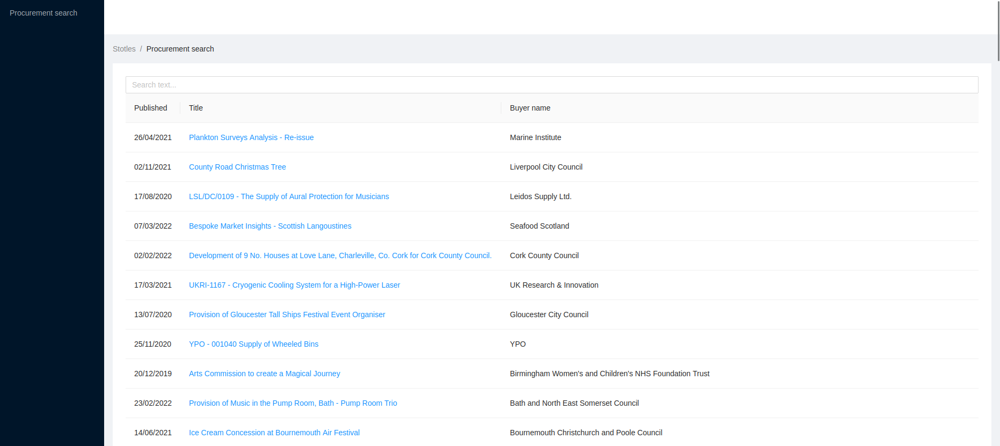

# Stotles work sample assignment

## Steve Goodwin - Notes/Feedback

### Frontend Client

- Having reviewed the initial layout on this my approach was to adapt the structure into something more in-line with more common practices and maintainability.
- I've added a few styling tweaks, but nothing major since this wasn't the given focus of the task, if we were to improve more in this area i'd suggest adopting a better way to manage styling. I've opted for CSS modules in the newer bits i've added as this is just something I prefer, but everyone has their preferences.
- Other areas for improvements are around the native functionality of AntDesign, the UX when selecting multiple buyer filters is fine on the one hand as you should update filters, but on the other the dropdown should close. I did try to get this working, but it pushed me over my allotted time, if I were more familiar with AntD's quirks I may have not suffered a time deficit on this part.

### Backend Server

- Again restructured this based on structure and patterns i've used in the past, have I had more time then I would've focused on Error and Response types so that these could be used across the controllers for their responses for consistent objects to be returned to the FE client.
- Having not done too much Sequelize before this was a refreshing task to see how I could abstract the database connection, had i'd had more time models could have been autoloaded and a proper application config of been added to house application wide config referencing process.env where required and allowing all configurable items to be centrally located.
- I've not used Express for sometime so there maybe some better / newer ways of gaining more performance gains than the solution I arrived at.

### Future Improvements

- Given more time tests could've been added, both for UI and features using tools such as Cypress and Storybook for component level testing.
- UX improvements would benefit a few places on the frontend to aid with user issues, i've added a small improvement to clear filters which at least highlights the buyer list isn't doing weird things when filtered.
- Another improvement would be to sort the list alphabetically, although by using AntD this allows a textual filter on the list, this however may not be initially obvious to the user.

## Getting started

This sample codebase consists of a separate client & server code.

It's set up in a simple way to make it as easy as possible to start making changes,
the only requirement is having recent versions of `node` & `npm` installed.

This is not a production ready configuration (nor production ready code),
it's only set up for easy development, including live reload.

To run the client bundler:

```
cd client
npm install
npm run dev
```

The processed code will be available at http://localhost:3001

To start the server:

```
cd server
npm install
npm run dev
```

The server will be available at http://localhost:3000 - the page is automatically configured
to use the assets served by vite on port 3001.

You should see something similar to this page:



### Disabling/Enabling TypeScript

If you prefer to completely disable TypeScript for a file, add `// @ts-nocheck` on the first line.
If on the other hand you'd like to enable strict type checking, modify `tsconfig.json` according to your needs.

Note that you can import plain JavaScript files that won't be fully typechecked.

### Browsing the database

You should start by looking at the migration in `./migrations` folder.
If you prefer to browse the DB using SQL, you can use the sqlite command line (just run `sqlite3 ./db.sqlite3`)
or any other SQL client that supports sqlite.

If for any reason the database becomes unusable, you can rebuild it using `./reset_db.sh` script`.

## The task

All the instructions are available [here](https://www.notion.so/stotles/Full-stack-software-engineer-work-sample-assignment-ae7c64e08f2a42a097d16cee4bc661fc).
